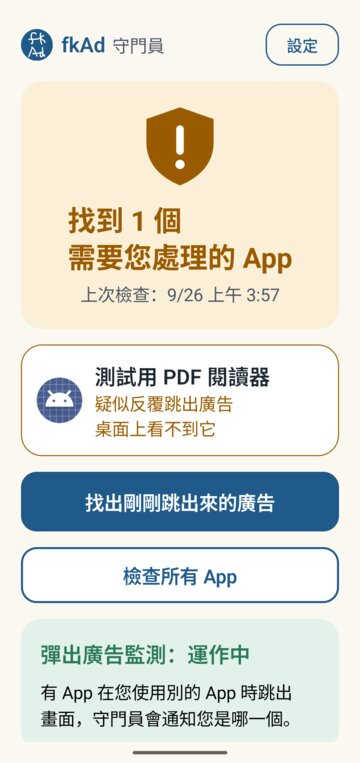
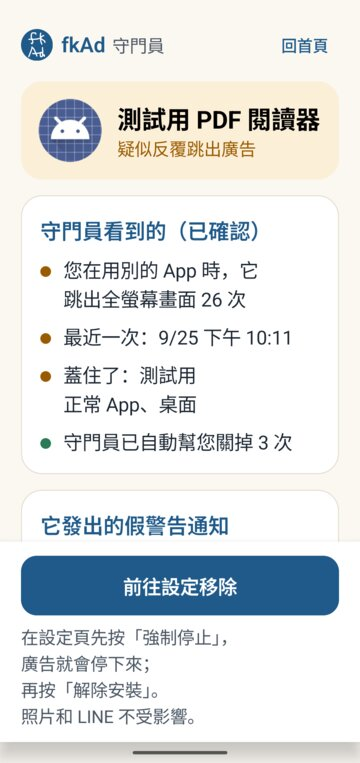
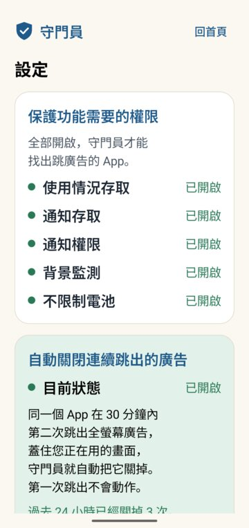

<p align="center"></p>

<h1 align="center">守門員 fkAd</h1>

<p align="center">
幫長輩找出、關掉「一直跳廣告、假裝手機中毒」的 App。<br>
所有判斷都在手機上完成，<b>守門員沒有網路權限</b>。
</p>

<p align="center"><b>繁體中文</b> ｜ <a href="README.zh-CN.md">简体中文</a> ｜ <a href="README.en.md">English</a></p>

<p align="center">



</p>

> **狀態：0.5.0，家人測試中。** 目前在 vivo（Android 16）、OPPO（Android 15）實機和 Android 16 模擬器上測試過。這還不是正式版，安裝檔是測試用的 debug 簽章。

## 為什麼要做

長輩的手機很常出現這種情況：

- 從 Play 商店裝了「PDF 閱讀器」「QR Code 掃描」「手機清理」之類的 App。
- 之後不管在用什麼，都會突然跳出全螢幕廣告。
- 或是收到「手機中毒了！立即清理」的假警告。

年輕人看得出是哪個 App 在搞鬼，長輩通常看不出來，只會覺得「手機壞了」。

守門員要做的就是一句話：**告訴長輩是哪一個 App，並帶他一步一步移除。**

## 功能

| 功能 | 怎麼做到 |
|---|---|
| **檢查所有 App** | 逐一看每個 App 的內容：廣告程式有幾家、會不會在開機或充電時自己啟動、有沒有把桌面圖示藏起來、名稱是不是常見的誘餌類型（清理、防毒、PDF、QR、相簿保險箱…）、權限跟用途對不對得上、程式有沒有刻意混淆。演算法見 [docs/ALGORITHM.md](docs/ALGORITHM.md) |
| **找出剛剛跳出來的廣告** | 讀取系統的畫面切換紀錄（「使用情況存取」），找出是哪個 App 把全螢幕廣告蓋在別的 App 上面。可以事後查，守門員當時沒開著也查得到 |
| **假警告通知的來源** | 判斷通知是不是「威脅字眼＋催促字眼」的假警告，並找出發送的 App；如果是 Chrome 的網站推播，會指出是哪個網站。通知文字只在記憶體裡判斷，不會存下來 |
| **自動關閉連續跳出的廣告**（選用） | 同一個 App 在 30 分鐘內**第二次**把廣告蓋在別的 App 上，就自動按返回或回到桌面。第一次只記錄，不會動作。要在「無障礙」設定裡開啟 |
| **新裝的 App 立刻檢查** | 裝好後 3 秒、2 分鐘、30 分鐘各檢查一次，因為有些 App 第一次打開後才會藏起圖示 |
| **帶著移除** | 先「強制停止」讓廣告停下來，再「解除安裝」。守門員不能替使用者刪 App，也不會假裝可以 |
| **記錄檔**（選用） | 使用者同意後，才會在手機裡記錄檢查結果、出錯的情形和自動關閉的過程。到「設定 → 匯出記錄檔」，由使用者自己選擇用 LINE 或 Email 傳出去 |

介面是照「只有一位長輩自己一個人也能用」來設計的：大字、一個畫面只做一件事，也不怕系統字體被放大。返回鍵一次退一頁。設計原則見 [docs/DESIGN-NOTES.md](docs/DESIGN-NOTES.md)。

## 隱私

- **沒有 `INTERNET` 權限。** 所有判斷都在手機上完成，資料不會自己傳出去。
- 不存通知內容。網址只記網站名稱。
- 無障礙服務只接收「視窗切換」事件，**不讀取畫面上的文字**（`canRetrieveWindowContent=false`）。
- 診斷記錄預設關閉，最多保留 14 天。關掉開關，已記下的資料會一起刪除。

## 做不到的事（誠實列出）

- **YouTube 影片裡或網頁裡的廣告**：那是 YouTube 或網站自己的廣告，不是另一個 App 跳出來的，守門員管不到。
- **浮在畫面上的小視窗**（overlay）：Android 沒有提供方法查出是哪個 App 放的。
- **守門員被「強制停止」之後**就沒有保護了，要等使用者再打開一次。
- 從「最近使用的 App」切回一個最上面剛好是廣告頁的 App，會被算一次跳出。這個情況和「廣告自己跳出來」在公開的 Android API 上分不出來。
- 「沒有發現」不代表一定安全，畫面上也會這樣寫。

## 安裝（測試版）

1. 到 [Releases](../../releases) 下載 `fkAd-0.5.0-debug.apk` 並安裝。需要 Android 8.0 以上。
2. 打開守門員，按「設定」，照畫面把「保護功能需要的權限」全部打開：使用情況存取、通知存取、通知權限、不限制電池。
3. **OPPO／realme（ColorOS）**：另外要到「應用程式資訊 → 耗電管理」打開「允許應用程式背景行為」。
4. **vivo**：如果電池頁只看到開關，請點「允許在背景使用」這幾個字，再選「不限制」。
5. 想開自動關廣告的話：Android 13 以上，自行安裝的 App 要先到「應用程式資訊 → 右上角 ⋮ → 允許受限制的設定」，才能在「無障礙」裡開啟守門員。

## 開發

```bash
# Android App（需要 JDK 17+ 和 Android SDK）
cd android
./gradlew assembleDebug          # 輸出在 app/build/outputs/apk/debug/
./gradlew testDebugUnitTest      # 單元測試；用到真實手機事件的測試，沒有本機資料時會自動略過

# 電腦版參考實作（需要 aapt2；可以用 AAPT2=/path/to/aapt2 指定）
python3 engine/egda.py path/to/app-dir-or-apks

# 評估（需要本機的 APK 資料集，不在 repo 裡；路徑用 EG_DATA 指定）
EG_DATA=/path/to/dataset python3 engine/evaluate.py
```

**測試用 App**（`testapps/`，**只能裝在模擬器上**）：

- `adsim`：模擬會藏圖示、蓋在別的 App 上跳廣告、發假警告通知的 App。
- `normalapp`：正常的 App，也有 App 內插頁廣告，用來確認不會誤判。

兩者都不含真正的廣告程式，也不會連網。

## 專案結構

```
android/     守門員 App（Kotlin、Jetpack Compose）
engine/      演算法 EGDA 的電腦版參考實作與評估腳本（Python）
testapps/    只能在模擬器使用的測試 App
tools/       測試用腳本（ui.sh：讀取畫面文字並點擊；safe_shot.sh：只在守門員在最上層時截圖）
docs/        計畫、演算法、審核標準、設計筆記、實機事件紀錄
design/      圖示原稿
```

主要文件：

- [docs/PLAN.md](docs/PLAN.md)：計畫與決策紀錄
- [docs/ALGORITHM.md](docs/ALGORITHM.md)：EGDA 演算法與評估結果
- [docs/REVIEW-STANDARD.md](docs/REVIEW-STANDARD.md)：審核標準摘要
- [docs/incident-2026-09-25.md](docs/incident-2026-09-25.md)：一次真實漏判的調查、修正與後續實機測試

## 授權

[GPL-3.0](LICENSE)。可以自由使用、修改、散布；修改後再散布，也必須用 GPL-3.0 開放原始碼。

圖示是手繪的「fk Ad」。
